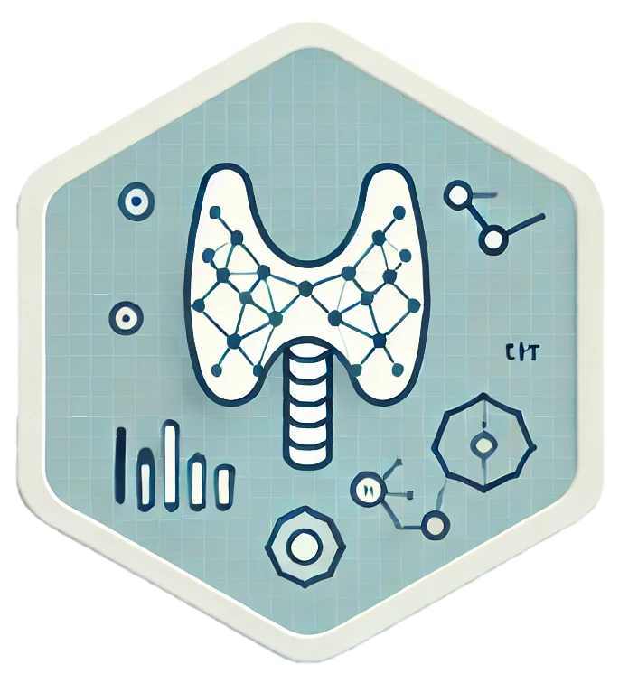

<!-- README.md is generated from README.Rmd. Please edit that file -->
```{r, echo = FALSE}
knitr::opts_chunk$set(
  collapse = TRUE,
  comment = "#>",
  fig.path = "man/figures/README-",
  out.width = "100%"
)
```

# Thyroid Cancer Recurrence Prediction <a href='website'></a>

<!-- badges: start -->
[](https://lifecycle.r-lib.org/articles/stages.html)
<!-- badges: end -->

### MIT PRIMES Research Report

#### Important Dates

- May 31: Research period ends.
- June 15: Interim research report due.

### Generating the `.tex` File

### Repository Workflow Guidelines

To maintain an organized workflow within our repository, please adhere to the following guidelines:

- **Branch Management**: Always work out of the `develop` branch.

- **Handling Questions and Discussions**:
  - If you have any questions or need to discuss a topic, please tag me in the relevant issue.
  - If there is no related issue, feel free to create a new one.

- **Pull Requests (PRs)**:
  - Do not merge changes directly to the `develop` branch. Instead, create a PR.
  - Assign your team members as reviewers for your PR to ensure quality and collaborative improvements.

- **Issue Management**:
  - Assign yourself to an issue by marking yourself as the `Assignee`.
  - Utilize our **PRIMES Manuscript Progress** Project board to manage and track tasks:
    - Add new issues to the **TODO** card.
    - Move issues to the **In Progress** or **Done** card as you progress.
    - Adjust the timeline if needed, ensuring to communicate these changes with the team.

#### Additional Resources
- [Creating Pull Requests](https://help.github.com/en/articles/creating-a-pull-request)
- [Assigning Issues](https://help.github.com/en/articles/assigning-issues-and-pull-requests-to-other-github-users)
- [Using Project Boards](https://help.github.com/en/articles/about-project-boards)

Following these guidelines will help us keep our project organized and moving forward efficiently. If you're unsure about any of the steps, please let me know.


